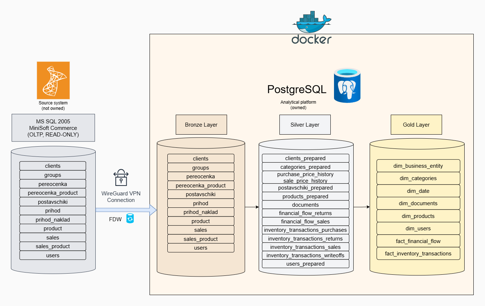
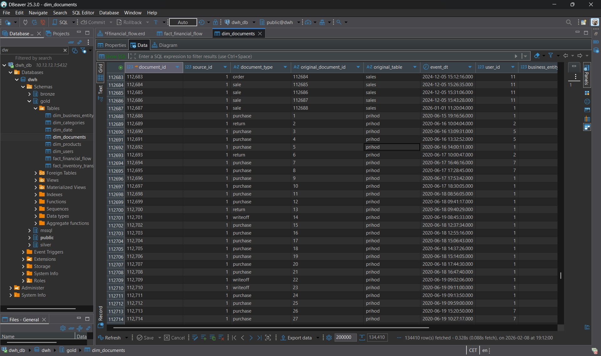
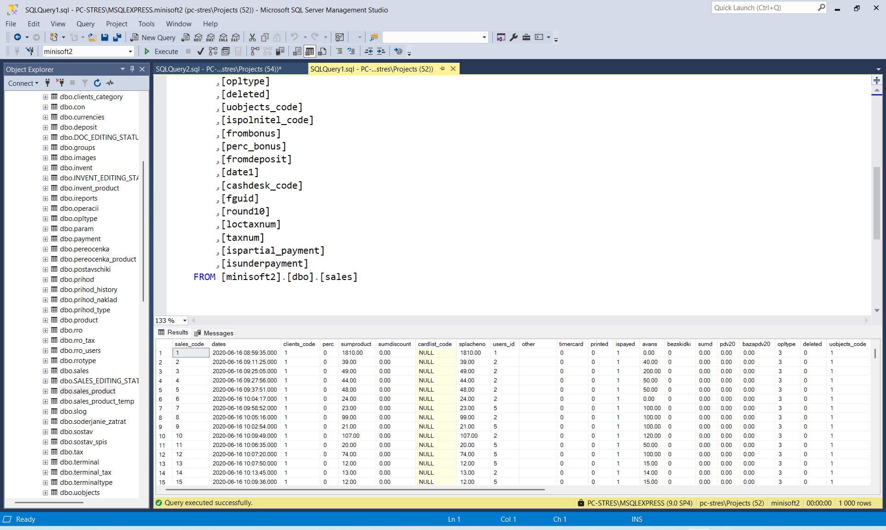
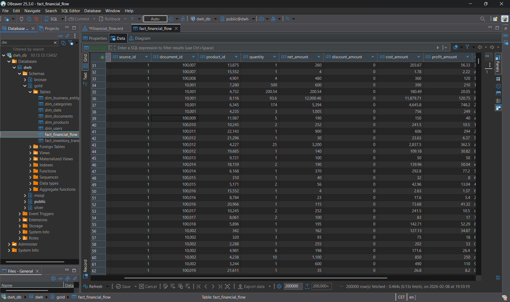
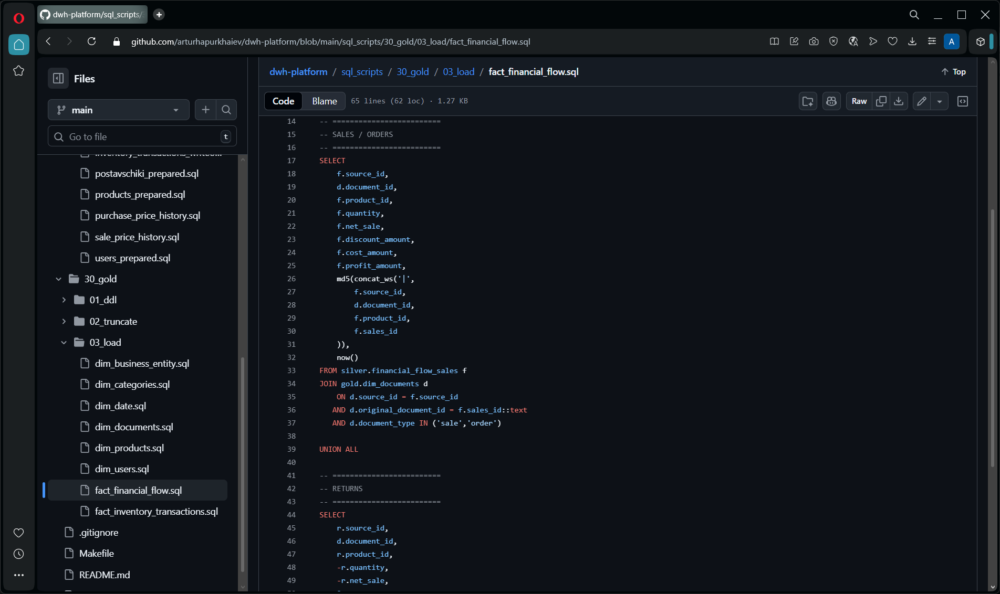
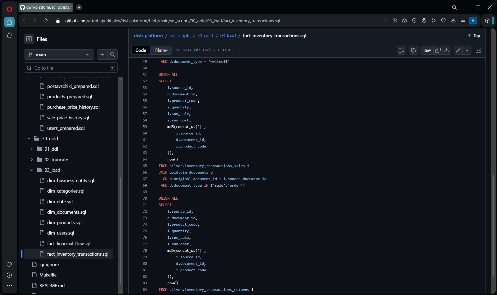
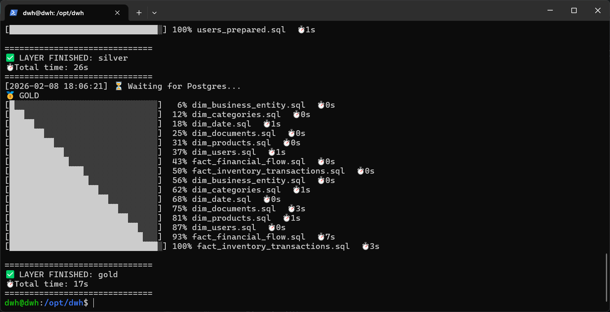
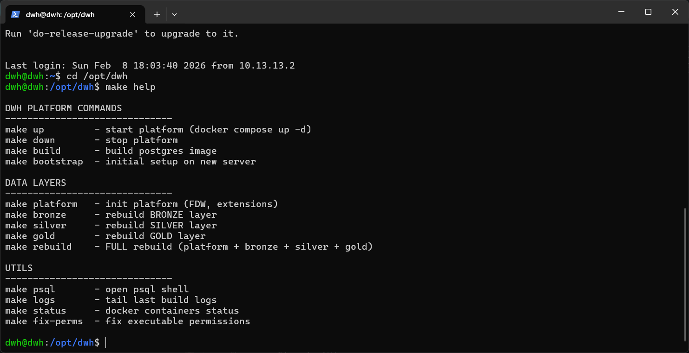

## 🎯 Project Positioning — Analytics-First Platform

This project is an **analytics-first data platform**, designed and built from the perspective of a **Data Analyst who wants to fully understand and control the data behind analytics**.

The goal of the platform is not to build complex ETL pipelines, but to ensure that:

- analytics is **fully decoupled from the OLTP system**
- data transformations are **transparent and expressed in SQL**
- analytical results are **reproducible and explainable**
- the entire system can be safely rebuilt on a new server at any time

This repository reflects an **analytics-driven approach to data platform design**, where analytical correctness and trust in data are treated as first-class concerns.

# 🧱 DWH Platform for MiniSoft Commerce

A reproducible analytical Data Warehouse (DWH) platform for **MiniSoft Commerce** (MS SQL Server 2005).

---

## 🌍 Language / Мова
* [English](#english-version)
* [Українська](#ukrainian-version)

---

<a name="english-version"></a>
## English Version

### 🎯 Project Goal
* Decouple analytics from the OLTP system
* Build a stable analytical DWH on PostgreSQL
* Ensure full reproducibility on a new server
* Use a SQL-first approach without imperative ETL

 ## 🧠 Why Analytics-First?

Many analytical problems are not caused by incorrect queries, but by:

- hidden or opaque ETL logic
- unclear data ownership
- unsafe rebuild processes
- tight coupling between analytics and OLTP systems

This project approaches the data warehouse as a **core analytical asset**, not as a side-effect of data ingestion tooling.

Key ideas behind the analytics-first approach:

- analytics defines the requirements
- engineering enforces the constraints
- SQL is the shared language between analysis and transformation


### 🧭 Architecture Overview
## 🧭 Architecture Overview

The platform is built as a layered analytical data warehouse, fully decoupled from the OLTP system.



```text
MS SQL Server 2005 (MiniSoft, private network)
        │
        │  tds_fdw (via WireGuard VPN)
        ▼
PostgreSQL 16 (DWH)
│
├── mssql   — foreign tables (source contract)
├── bronze  — raw data copy
├── silver  — prepared and cleaned data
└── gold    — analytical model (facts / dimensions)
```
🧱 Data Layers (Bronze → Silver → Gold)

## 🧱 Data Layers

The data warehouse follows a strict layered architecture:

- **Bronze** — raw, immutable copies of source tables  
- **Silver** — cleaned, normalized, and semantically prepared data  
- **Gold** — analytical facts and dimensions designed for reporting

  ### 🟡 Bronze Layer (Raw Data)

The Bronze layer contains raw copies of source tables imported via FDW.
No transformations are applied at this stage.

Examples:
- `clients`
- `sales`
- `sales_product`
- `prihod`
- `product`
- `users`

This layer serves as a stable, reproducible snapshot of the source system.
### ⚪ Silver Layer (Prepared Data)

The Silver layer transforms raw source data into analytical-friendly structures.

Key transformations:
- normalization of document types
- separation of financial and inventory flows
- explicit sign handling (sales / returns / write-offs)
- preparation of price history and reference tables
- ## 📄 Document Normalization (Gold)

All operational documents (sales, purchases, returns, write-offs)
are normalized into a single document dimension.


Why this matters:

one document model for all facts

consistent joins across financial and inventory flows

explicit document semantics (document_type, original_table)

## 💰 Financial Flow Transformation

Sales and returns from the OLTP system are transformed into a unified financial fact table.



↓


### 🧠 Key Design Decisions

- Sales and returns are stored separately in Silver
- Direction (+ / −) is applied during Gold unification
- Profit is calculated explicitly, not inferred
### 🧮 Gold Financial Flow Logic (SQL)

The financial fact is built using explicit UNION ALL logic
to preserve transparency and correctness.



## 📦 Inventory Transactions

Inventory movements are modeled independently from financial flows
and unified at the Gold layer.




🧩 Core Principles
* FDW instead of ETL — direct reads from MS SQL.

* Layered architecture: bronze → silver → gold.

* Idempotency — safe re-runs at any time.

* Infrastructure as Code — Docker + SQL.

## 🧩 Core Invariants (Non-Negotiable)

The platform is built around a set of strict invariants that must always hold:

- The OLTP system is **never written to**
- Source access is **read-only and isolated**
- FDW is used only as a **data access contract**, never for transformations
- Platform initialization is **explicit and manual**
- Data layers (Bronze / Silver / Gold) are **safe to rebuild repeatedly**
- Rebuild order is **strictly enforced**
- No credentials or secrets are stored in Git
- All transformations are implemented in **plain SQL**

These invariants are more important than any specific technology choice and define the operational safety of the platform.

🔐 Source Access (WireGuard VPN)
[!IMPORTANT] The MS SQL database is located inside a private network and is accessible only via WireGuard VPN.
```
[DWH Server] ── WireGuard VPN ── [Private Network] ── MS SQL 2005
```
* VPN must be active before platform startup.

* WireGuard configuration is not part of this repository.

* FDW connects to the internal MS SQL IP address.

🔐 Source Access & Security
[IMPORTANT] The MS SQL source database is accessed using a dedicated read-only user:

User: dwh_extractor
Permissions: READ-ONLY
Purpose: Analytical data extraction via FDW

The user has no write or administrative privileges

It exists exclusively for DWH access

This guarantees zero impact on the OLTP system

🔧 MS SQL Connection Configuration (FDW)
All MS SQL connection parameters are defined in: 
```
sql_scripts/00_platform/fdw_init.sql
```
```SQL
CREATE SERVER minisoft_mssql
FOREIGN DATA WRAPPER tds_fdw
OPTIONS (
  servername '10.0.1.43',
  port '1433',
  database 'minisoft2',
  tds_version '7.4'
);
```
🚀 Execution Flow
First Run (New Server)
```
make build
make bootstrap
make platform
make rebuild
```
Result: a fully operational analytical DWH.

## 🔁 Rebuild Process

Rebuilds are safe, repeatable, and observable operations.



Regular Rebuild
```
make rebuild
```
Rebuilds are considered a normal and safe operation, not an exceptional event.

Unsafe Operations (By Design)

The following actions are intentionally excluded from automated workflows:

automatic FDW imports

platform re-initialization during rebuild

any write operations to the source system

This separation protects both the OLTP system and the analytical platform.

 ```
 **Run `make help` to see the list of available automated commands.
```
## 🛠️ Automation

The platform is fully controlled via Makefile commands.



➕ Adding New Source Tables
Update fdw_import.sql.

Run FDW import manually.

Add Bronze / Silver / Gold logic.

[!WARNING] Foreign tables are not imported automatically by design.
```md
## 🧭 Author’s Perspective

This project was built by a **Data Analyst learning data engineering through real systems**, not through abstract examples.

The focus is on understanding:
- where analytical data comes from
- how it can safely change
- and how analytical trust is established

The platform reflects the belief that **better analysts are those who understand the systems behind their data**.
```
Artur Hapurkhaiev 
DWH / Data Platform Engineering


<a name="ukrainian-version"></a>
## 🎯 Позиціонування проєкту — Analytics-First Platform

Цей проєкт — **analytics-first data платформа**, створена з позиції **дата-аналітика, який хоче повністю розуміти та контролювати дані, з якими працює**.

Мета платформи — не побудова складних ETL-пайплайнів заради них самих, а забезпечення того, щоб:

- аналітика була **повністю відокремлена від OLTP-системи**
- всі перетворення даних були **прозорими та описаними в SQL**
- аналітичні результати були **відтворюваними та пояснюваними**
- всю систему можна було **безпечно перебудувати на новому сервері**

Цей репозиторій відображає **аналітично-орієнтований підхід до проєктування data-платформ**, де довіра до даних і коректність аналітики є ключовими.

Ukrainian Version

🎯 Мета проєкту
* Відокремити аналітику від OLTP-системи

* Побудувати стабільне DWH на PostgreSQL

* Забезпечити повну відтворюваність на новому сервері

* Використовувати SQL-first підхід без імперативного ETL

  ## 🧠 Чому Analytics-First?

Більшість проблем в аналітиці виникають не через неправильні SQL-запити, а через:

- приховану або непрозору ETL-логіку
- нечітке володіння даними
- небезпечні процеси перебудови
- сильну привʼязку аналітики до OLTP-систем

У цьому проєкті Data Warehouse розглядається як **ключовий аналітичний актив**, а не побічний результат завантаження даних.

Основні ідеї analytics-first підходу:

- аналітика формує вимоги
- інженерія забезпечує обмеження
- SQL є спільною мовою між аналізом і трансформацією


🧭 Архітектура
```
MS SQL Server 2005 (MiniSoft, приватна мережа)
        │
        │  tds_fdw (через WireGuard VPN)
        ▼
PostgreSQL 16 (DWH)
│
├── mssql   — foreign tables (контракт джерела)
├── bronze  — сирі дані
├── silver  — підготовлені та очищені дані
└── gold    — аналітична модель
```
🧩 Основні принципи
* FDW замість ETL — пряме читання з MS SQL.

* Шарова архітектура: bronze → silver → gold.

* Ідемпотентність — безпечні повторні запуски.

* Infrastructure as Code — Docker + SQL.

## 🧩 Ключові інваріанти (Непорушні правила)

Платформа побудована навколо набору суворих інваріантів, які мають виконуватися завжди:

- OLTP-система **ніколи не змінюється**
- Доступ до джерела є **виключно read-only та ізольованим**
- FDW використовується лише як **контракт доступу до даних**, а не для трансформацій
- Ініціалізація platform-рівня є **явною та ручною**
- Data-рівні (Bronze / Silver / Gold) можна **безпечно перебудовувати необмежену кількість разів**
- Порядок перебудови шарів є **строго визначеним**
- Жодні креденшали або секрети **не зберігаються в Git**
- Усі перетворення реалізовані **в чистому SQL**

Ці інваріанти є важливішими за будь-який конкретний інструмент і визначають безпеку та надійність платформи.

🔐 Доступ до джерела (WireGuard VPN)
[!IMPORTANT] База MS SQL знаходиться у закритій мережі. Доступ можливий лише через WireGuard VPN.
```
[DWH Server] ── WireGuard VPN ── [Приватна мережа] ── MS SQL 2005
```
* VPN має бути активним до запуску платформи.

* WireGuard не входить до цього репозиторію.

* FDW використовує внутрішню IP-адресу MS SQL.
* 🔐 Доступ та безпека
[ВАЖЛИВО]
Для доступу до MS SQL використовується окремий read-only користувач:

Користувач: dwh_extractor
Права: тільки читання
Призначення: аналітичне читання через FDW

Користувач не має прав запису

Використовується виключно для DWH

Гарантує відсутність впливу на OLTP

* 🔧 Налаштування підключення (FDW)
Усі параметри зʼєднання знаходяться у файлі: sql_scripts/00_platform/fdw_init.sql

* 🚀 Порядок запуску
Перший запуск (новий сервер)
```
make build
make bootstrap
make platform
make rebuild
```
Результат: повністю готове аналітичне DWH.

Регулярна перебудова (Безпечна операція)
```
make rebuild
```
Небезпечні операції (Навмисно виключені)

Наступні дії свідомо не автоматизовані:

автоматичний імпорт foreign tables

повторна ініціалізація platform-рівня під час rebuild

будь-які операції запису в джерельну систему

Таке розділення захищає як OLTP-систему, так і аналітичну платформу.

 ```
 **Виконайте `make help`, щоб переглянути список доступних автоматизованих команд.
```
➕ Додавання нових таблиць
Оновити fdw_import.sql.

Запустити імпорт вручну.

Додати Bronze / Silver / Gold логіку.
```md
## 🧭 Авторська перспектива

Цей проєкт створений **дата-аналітиком, який вивчає data engineering через побудову реальних систем**, а не абстрактних прикладів.

Основний фокус — розуміння:
- звідки зʼявляються аналітичні дані
- як вони можуть змінюватися безпечно
- як формується довіра до аналітичних результатів

Платформа відображає переконання, що **кращі аналітики — це ті, хто розуміє системи, які стоять за їхніми даними**.
```
Artur Hapurkhaiev 
DWH / Data Platform Engineering
